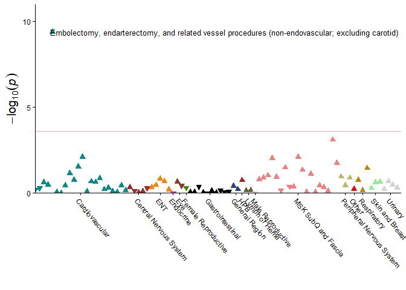

<!-- README.md is generated from README.Rmd. Please edit that file -->

# ProcWAS

<!-- badges: start -->
<!-- badges: end -->

The goal of ProcWAS is to adapt existing functionality from a
Phenome-wide Association Study (PheWAS) to procedures.

## Installation

You can install the development version of ProcWAS like so:

``` r
# install ProcWAS package
install.packages("devtools")
devtools::install_github("uelandte/ProcWAS")
library(ProcWAS)
```

## Tutorial

This walks through a demonstration of using the ProcWAS package for
simulated data

``` r
devtools::install_github("uelandte/ProcWAS")
#> Using GitHub PAT from the git credential store.
#> Downloading GitHub repo uelandte/ProcWAS@HEAD
#> 
#> ── R CMD build ─────────────────────────────────────────────────────────────────
#> * checking for file 'C:\Users\uelante1\AppData\Local\Temp\RtmpAvghed\remotes58b022a35a11\uelandte-ProcWAS-4a96bb5/DESCRIPTION' ... OK
#> * preparing 'ProcWAS':
#> * checking DESCRIPTION meta-information ... OK
#> * checking for LF line-endings in source and make files and shell scripts
#> * checking for empty or unneeded directories
#> * building 'ProcWAS_0.1.tar.gz'
#> 
#> Installing package into 'C:/Users/uelante1/Rpackages'
#> (as 'lib' is unspecified)
library(ProcWAS)
#> Loading required package: dplyr
#> 
#> Attaching package: 'dplyr'
#> The following objects are masked from 'package:stats':
#> 
#>     filter, lag
#> The following objects are masked from 'package:base':
#> 
#>     intersect, setdiff, setequal, union
#> Loading required package: ggplot2
#> Loading required package: parallel
#> Loading required package: tidyr

# Set seed for reproducibility
set.seed(123)

# Create source codes data frame
source_codes_df <- ProcWAS::icd10_cpt4_source_to_ccsr   %>%
  select(vocabulary, code)  %>%
  slice_sample(n = 10000)  %>%
  mutate(id = rep(1:1000, each = 10),
       date = seq.Date(Sys.Date(), by = "-1 day", length.out = 10000)
)

head(source_codes_df)
#>   vocabulary    code id       date
#> 1      icd10 0V1P0ZJ  1 2025-01-02
#> 2  cpt_hcpcs   0748T  1 2025-01-01
#> 3      icd10 021K09R  1 2024-12-31
#> 4  cpt_hcpcs   27745  1 2024-12-30
#> 5      icd10 0FH203Z  1 2024-12-29
#> 6      icd10 0F794ZZ  1 2024-12-28
```

``` r
# Map source codes to CCSR categories and reshape to wider
phenotypes_df <- create_ccsr_phenotypes(source_codes_df = source_codes_df)
#> 10000 rows, 1000 participant ids in input data
#> 1000 participant ids had procedures mapped to CCSR codes on distinct days
#> All ids had a procedure that were mapped to at least one CCSR code.

head(phenotypes_df)
#> # A tibble: 6 × 200
#>      id CAR004 CAR013 GIS025 HEP008 HEP013 MRS007 MST008 MST011 MST019 MST029
#>   <int> <lgl>  <lgl>  <lgl>  <lgl>  <lgl>  <lgl>  <lgl>  <lgl>  <lgl>  <lgl> 
#> 1     1 TRUE   TRUE   TRUE   TRUE   TRUE   TRUE   TRUE   TRUE   TRUE   TRUE  
#> 2     2 FALSE  FALSE  FALSE  FALSE  FALSE  TRUE   FALSE  FALSE  FALSE  TRUE  
#> 3     3 FALSE  FALSE  FALSE  FALSE  TRUE   FALSE  FALSE  FALSE  FALSE  FALSE 
#> 4     4 FALSE  FALSE  FALSE  FALSE  TRUE   TRUE   FALSE  TRUE   FALSE  TRUE  
#> 5     5 FALSE  FALSE  FALSE  FALSE  FALSE  FALSE  TRUE   FALSE  FALSE  TRUE  
#> 6     6 FALSE  FALSE  FALSE  FALSE  FALSE  FALSE  FALSE  FALSE  FALSE  FALSE 
#> # ℹ 189 more variables: CAR006 <lgl>, CAR010 <lgl>, CAR011 <lgl>, GIS007 <lgl>,
#> #   GNR001 <lgl>, MST017 <lgl>, MST023 <lgl>, RES014 <lgl>, CAR008 <lgl>,
#> #   CAR020 <lgl>, CAR021 <lgl>, GIS029 <lgl>, URN003 <lgl>, CAR012 <lgl>,
#> #   CNS010 <lgl>, GIS021 <lgl>, MST014 <lgl>, RES005 <lgl>, CAR007 <lgl>,
#> #   GIS009 <lgl>, MST016 <lgl>, MST030 <lgl>, EYP002 <lgl>, GIS018 <lgl>,
#> #   LYM002 <lgl>, MST009 <lgl>, CAR019 <lgl>, FRS015 <lgl>, GIS014 <lgl>,
#> #   MST006 <lgl>, MST028 <lgl>, ENT006 <lgl>, ENT012 <lgl>, LYM003 <lgl>, …
```

``` r
# Create covariates data frame. Some of the individuals in the covariates data frame are not present in phenotypes data frame
covariates_df <- tibble(
  id = 1:15000,
  age = sample(18:65, 15000, replace = TRUE),
  sex = sample(c("M", "F"), 15000, replace = TRUE),
  has_my_variant_of_interest = sample(c(TRUE, FALSE), 15000, replace = TRUE)
)

head(covariates_df)
#> # A tibble: 6 × 4
#>      id   age sex   has_my_variant_of_interest
#>   <int> <int> <chr> <lgl>                     
#> 1     1    21 F     TRUE                      
#> 2     2    39 M     FALSE                     
#> 3     3    50 M     TRUE                      
#> 4     4    56 M     FALSE                     
#> 5     5    18 M     TRUE                      
#> 6     6    47 M     TRUE
```

``` r
# merge pheno with covariates
pheno_cov_df <- merge_pheno_with_cov(phenotypes_df = phenotypes_df,
                                      covariates_df = covariates_df)  %>% 
# create signal for CAR007
mutate(has_my_variant_of_interest = ifelse(CAR007 == TRUE & runif(n()) < 0.4, TRUE, has_my_variant_of_interest))
#> 14000 rows in covariates data do not have a match in phenotypes data.
#> Appending these individuals as controls to the input data.
```

``` r
# exclude sex-specific procedures
phewas_df <- apply_sex_specific_exclusions(phewas_df = pheno_cov_df,
                                                   name_of_sex_column = "sex")
```

``` r
results <- phewas_ext(data = phewas_df, 
                     phenotypes = stringr::str_subset(names(phewas_df), "^[A-Z]{3}[0-9]{3}$"), # extract column names with 3 uppercase letters followed by 3 digits consistent with CCSR naming 
                     genotypes = c("has_my_variant_of_interest"),
                     covariates = c("sex", "age"),
                     additive.genotypes = FALSE,
                     cores = 1)
#> Finding associations...
#> Compiling results...
#> Cleaning up...
```


