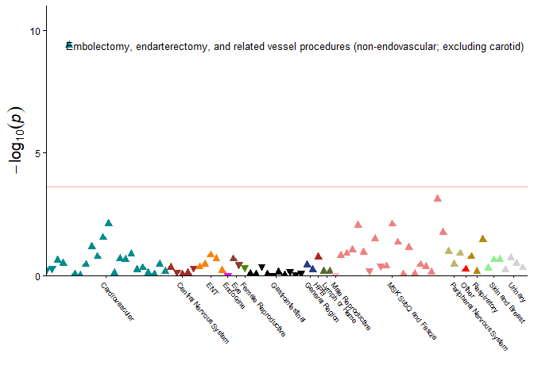

<!-- README.md is generated from README.Rmd. Please edit that file -->

# ProcWAS

<!-- badges: start -->
<!-- badges: end -->

## Description

The goal of the ProcWAS package is to adapt existing functionality from
the Phenome-wide Association Study (PheWAS) package for procedural
applications. The code in this package has been adapted from two
existing packages: PheWAS (<https://github.com/PheWAS/PheWAS/>) and
PedsPheWAS(<https://github.com/monikagrabowska/PedsPheWAS>)

## Installation

You can install the development version of ProcWAS like so:

``` r
# install and load required packages 
reqd_packages <- c("dplyr", "tidyr", "glue", "parallel", "devtools", "ggplot2", "ggrepel", "devtools")
my_installed_packages <- reqd_packages %in% rownames(installed.packages())
if (any(installed_packages == FALSE)) {
  install.packages(reqd_packages[!installed_packages])
}
invisible(lapply(reqd_packages, library, character.only = TRUE))

## confint migrated to stats package in R 4.4.0, and can be used to calculate confidence intervals in ProcWAS. If using R < 4.4.0, must manually load MASS package
## library(MASS)

# install ProcWAS package
devtools::install_github("uelandte/ProcWAS")
library(ProcWAS)
```

## Procedure Code Mapping

This package uses the Clinical Classifications Software Refined (CCSR)
from the Agency for Healthcare Research and Quality (AHRQ). This
framework includes 320 procedure categories that have previously been
mapped from over 80,000 ICD-10-PCS codes. We limit focus to “major
therapeutic” procedures, which are those that often occur in an
operating room and are performed with therapeutic intent.

To complement the existing ICD-10-PCS to CCSR code code, we developed a
file for mapping CPT-4 codes to CCSR categories for major therapeutic
procedures.

For additional information on the CCSR, see
<https://hcup-us.ahrq.gov/toolssoftware/ccsr/ccs_refined.jsp>

## Tutorial

This walks through a demonstration of using the ProcWAS package for
simulated data.

A ProcWAS requires 2 data frames 1. A data frame of source codes
(ICD-10-PCS and CPT-4 codes) along with dates of the procedure. 2. A
data frame of covariates (e.g. age, sex, genotype, genetic principal
components).

The workflow includes steps to map the source codes to CCSR categories,
reshape the data frame to a wider format, merge the phenotypes data with
the covariates data, apply sex-specific exclusions, and perform the
regression.

First we will generate a data frame of source codes (ICD-10-PCS and
CPT-4 codes) along with dates of the procedure.

``` r
library(ProcWAS)
library(dplyr)
#> 
#> Attaching package: 'dplyr'
#> The following objects are masked from 'package:stats':
#> 
#>     filter, lag
#> The following objects are masked from 'package:base':
#> 
#>     intersect, setdiff, setequal, union
library(magrittr)

# Set seed for reproducibility
set.seed(123)

# Create source codes data frame
source_codes_df <- ProcWAS::icd10_cpt4_source_to_ccsr   %>%
  select(vocabulary, code)  %>%
  slice_sample(n = 10000)  %>%
  mutate(id = rep(1:1000, each = 10),
       date = seq.Date(Sys.Date(), by = "-1 day", length.out = 10000)
)

head(source_codes_df)
#>   vocabulary    code id       date
#> 1      icd10 0V1P0ZJ  1 2025-01-09
#> 2  cpt_hcpcs   0748T  1 2025-01-08
#> 3      icd10 021K09R  1 2025-01-07
#> 4  cpt_hcpcs   27745  1 2025-01-06
#> 5      icd10 0FH203Z  1 2025-01-05
#> 6      icd10 0F794ZZ  1 2025-01-04
```

Next, we use the create_ccsr_phenotypes function to 1) map the source
codes to CCSR categories and 2) reshape the data frame to a wider
format. If there are individuals present in the source procedure code
data frame which do not have any mapped CCSR categories, a message is
printed reminding the user that these individuals will be dropped from
the phenotypes data frame. To include them in the regression, they will
need to be present in the covariates data frame.

``` r
# Map source codes to CCSR categories and reshape to wider
phenotypes_df <- create_ccsr_phenotypes(source_codes_df = source_codes_df)
#> 10000 rows, 1000 participant ids in input data
#> 1000 participant ids had procedures mapped to CCSR codes on distinct days
#> All ids had a procedure that were mapped to at least one CCSR code.

head(phenotypes_df)
#> # A tibble: 6 × 200
#>      id CAR004 CAR013 GIS025 HEP008 HEP013 MRS007 MST008 MST011 MST019 MST029
#>   <int> <lgl>  <lgl>  <lgl>  <lgl>  <lgl>  <lgl>  <lgl>  <lgl>  <lgl>  <lgl> 
#> 1     1 TRUE   TRUE   TRUE   TRUE   TRUE   TRUE   TRUE   TRUE   TRUE   TRUE  
#> 2     2 FALSE  FALSE  FALSE  FALSE  FALSE  TRUE   FALSE  FALSE  FALSE  TRUE  
#> 3     3 FALSE  FALSE  FALSE  FALSE  TRUE   FALSE  FALSE  FALSE  FALSE  FALSE 
#> 4     4 FALSE  FALSE  FALSE  FALSE  TRUE   TRUE   FALSE  TRUE   FALSE  TRUE  
#> 5     5 FALSE  FALSE  FALSE  FALSE  FALSE  FALSE  TRUE   FALSE  FALSE  TRUE  
#> 6     6 FALSE  FALSE  FALSE  FALSE  FALSE  FALSE  FALSE  FALSE  FALSE  FALSE 
#> # ℹ 189 more variables: CAR006 <lgl>, CAR010 <lgl>, CAR011 <lgl>, GIS007 <lgl>,
#> #   GNR001 <lgl>, MST017 <lgl>, MST023 <lgl>, RES014 <lgl>, CAR008 <lgl>,
#> #   CAR020 <lgl>, CAR021 <lgl>, GIS029 <lgl>, URN003 <lgl>, CAR012 <lgl>,
#> #   CNS010 <lgl>, GIS021 <lgl>, MST014 <lgl>, RES005 <lgl>, CAR007 <lgl>,
#> #   GIS009 <lgl>, MST016 <lgl>, MST030 <lgl>, EYP002 <lgl>, GIS018 <lgl>,
#> #   LYM002 <lgl>, MST009 <lgl>, CAR019 <lgl>, FRS015 <lgl>, GIS014 <lgl>,
#> #   MST006 <lgl>, MST028 <lgl>, ENT006 <lgl>, ENT012 <lgl>, LYM003 <lgl>, …
```

In the example ProcWAS, we will use covarates of age, sex, and a logical
column indicating whether the individual has our “variant of interest”.

``` r
# Create covariates data frame. Some of the individuals in the covariates data frame are not present in phenotypes data frame
covariates_df <- tibble(
  id = 1:15000,
  age = sample(18:65, 15000, replace = TRUE),
  sex = sample(c("M", "F"), 15000, replace = TRUE),
  has_my_variant_of_interest = sample(c(TRUE, FALSE), 15000, replace = TRUE)
)

head(covariates_df)
#> # A tibble: 6 × 4
#>      id   age sex   has_my_variant_of_interest
#>   <int> <int> <chr> <lgl>                     
#> 1     1    21 F     TRUE                      
#> 2     2    39 M     FALSE                     
#> 3     3    50 M     TRUE                      
#> 4     4    56 M     FALSE                     
#> 5     5    18 M     TRUE                      
#> 6     6    47 M     TRUE
```

The covariates data frame should include all participants that qualify
for study inclusion as either a case or a control. When merging the
wider mapped phenotypes data frame with the covariates data frame, the
default behavior is to append participants who are present in the
covariates data frame but not in the phenotypes data frame as controls.
This can be changed by setting the append_cov_without_pheno_as_controls
argument to FALSE.

``` r
# merge pheno with covariates
pheno_cov_df <- merge_pheno_with_full_pop_cov(phenotypes_df = phenotypes_df,
                                              covariates_df = covariates_df,
                                              append_cov_without_pheno_as_controls = TRUE)  %>% 
# create artificial signal for CAR007 CCSR category
mutate(has_my_variant_of_interest = ifelse(CAR007 == TRUE & runif(n()) < 0.4, TRUE, has_my_variant_of_interest))
#> 14000 rows in covariates data do not have a match in phenotypes data.
#> Appending these individuals as controls to the input data.
```

Sex-specific procedures can be excluded from the analysis by providing
the name of the sex column in the covariates data frame.

``` r
# exclude sex-specific procedures
phewas_df <- apply_sex_specific_exclusions(phewas_df = pheno_cov_df,
                                                   name_of_sex_column = "sex")
```

The regression models are fit using the phewas_ext function.

``` r
results <- phewas_ext(data = phewas_df, 
                     phenotypes = stringr::str_subset(names(phewas_df), "^[A-Z]{3}[0-9]{3}$"), # extract column names with 3 uppercase letters followed by 3 digits consistent with CCSR naming 
                     genotypes = c("has_my_variant_of_interest"),
                     covariates = c("sex", "age"),
                     additive.genotypes = FALSE,
                     cores = 1)
#> Finding associations...
#> Compiling results...
#> Cleaning up...
```

Manhattan plots for the results can be generated using the plotManhattan
function.


